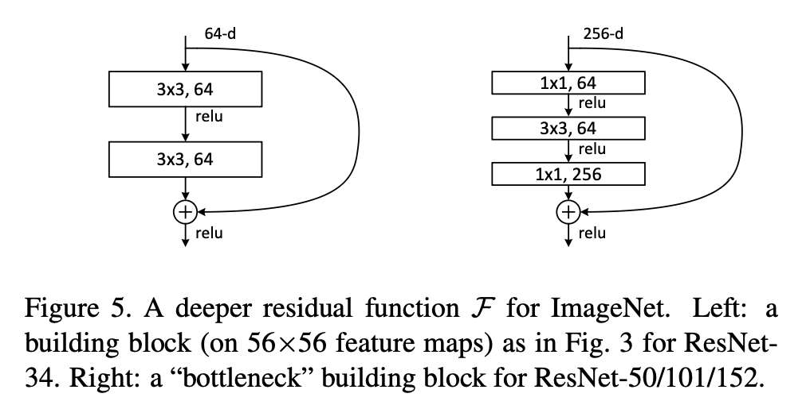

본 논문은 딥러닝에서 매우 깊은 신경망을 더 효과적으로 학습할 수 있도록 **residual learning framework를 제안**하는 논문임

# Introduction
Deep learning에서 network가 깊어질수록 강력한 표현력을 제공하지만, network가 깊어질 수록 학습이 어려워지는 문제가 발생함  
Network가 깊어질수록(deep) 강력한 표현력을 제공하는 이유는 레이어가 깊을수록 더 심도깊은 추상화로 전체적인 해석이 가능한 feature들을 추출하기 때문
- Low-level feature: edge, line, color 등의 낮은 추상화로 추출할 수 있는 정보
- Mid-level feature: texture, more complex feature과 같이 보다 깊은 추상화로 추출할 수 있는 정보
- High-level feature: 구체적인 개체나 장면의 의미론적 구조와 같이 매우 깊은 추상화로 추출할 수 있는 정보

즉, 차선과 같은 간단한 task들은 MLP(Multi-layer perceptron)으로 충분히 검출가능하지만, 이미지 내의 전체적인 구조나 의미를 찾기위해선 매우 깊은 신경망을 통해 심도깊은 feature들을 추출해야함 
Network가 깊어질수록 더 높은 수준의 feature를 추출할 수 있는 이유는 layer를 거치면 정보가 점점 더 추상화되기 때문  
1. **계측적 특징 학습**: 딥러닝 신경망에서는 각 layer가 이전 layer 출력을 입력으로 받아, 점차 더 복잡한 feature들을 학습함
    - 초반 layer들은 이미지의 기본적인 패턴, 예를 들면 가장자리(edge)나 단순한 모양 같은 기본적인 시각 패턴을 학습하고, 이 정보를 중간 layer로 전달함
2. **추상화의 진행**: 네트워크가 깊어지면서 중간 layer들은 이전 레이어에서 학습한 단순한 패턴을 조합하여 더 복잡한 패턴들을 학습함
    - 여러 가장자리들을 조합하여 패턴이나 모양같은 중간수준의 feature들을 학습함
3. **고수준의 특징 학습**: 가장 깊은 layer에서는 이전의 layer들에서 학습한 복잡한 패턴들을 다시 결합하여 구체적인 객체나 개념들에 대한 고수준의 feature들을 학습함
    - 고수준의 feature들은 특정 동물의 얼굴이나 자동차같은 전체적인 개체의 구조를 인식함
4. **기계적 추상화의 표현력**: Layer가 많아질수록 network는 점차적인 추상화를 통해 단순한 픽셀정보를 넘어서 의미론적이고 인식가능한 객체로 변환할 수 있는 능력이 향상됨
    - Layer가 얕을때는 low-level feature까지만 학습가능하지만, layer가 많아지면서 정보가 더 복잡하게 결합되고, 이를 통해 더 높은 수준의 표현이 가능해짐

#### But!
Network가 깊어질수록 성능이 좋아질 것 같지만, 여기서 발생하는 문제는 *network의 깊이가 깊어질수록 학습 정확도가 saturation에 도달한 후 점차 감소하는 degradation이 발생*하는데 이는 overfitting이 아닌 최적화(optimization)의 어려움에서 기인함

### Degradation problem 이란?

네트워크 깊이가 깊어질수록 더욱 복잡한 패턴을 학습할 수 있고, 따라서 더 높은 성능을 달성할 것으로 예상하는데 그렇지 못한 현상
RESNET에서는 degradation problem의 원인을 gradient vanishing 과 optimization difficulty라고 분석함
- **Gradient vanishing**: 네트워크가 깊어질수록 gradient가 backpropagation되는 과정에서 점점 작아져 학습이 어려워지는 현상
- **Optimization difficulty**: 네트워크가 깊어질수록 loss function이 복잡해짐에 따라 최적화하기 어려운 현상  

RESNET에서는 identity mapping을 통해 **residual의 개념을 적용한 결과 gradient vanishing 문제를 완화**하고, **단순 덧셈만을 추가하였기에 optimization difficulities가 증가하지 않아** 네트워크가 깊어지더라도 degration problem이 발생하지 않음

따라서 본 논문에서는 deep residual learning gramework를 통해서 network가 깊어지더라도 잘 학습할 수 있는 구조를 제안함
- Residual: 이전 레이어에서 학습된 특징과 현재 레이어에서 학습해야할 새로운 특징간의 차이 (우리가 흔히 아는 오차)

# Deep residual learning
### Residual learning
각 측이 단순히 원하는 함수 H(x)를 학습하는 대신, 입력 x에 대한 residual function F(x) = H(x)-x를 학습하도록 재구성하여 원하는 출력이 F(x)+x가 되도록하여 신경망이 학습할 수 있도록 함

**Why?** 네트워크가 여러 layer의 비선형성을 통해 복잡한 함수를 근사할 때. residual function이 원래의 함수를 학습하는 것보다 최적화에 더 용이할 수 있다는 가정에 기반함
- **Gradient vanishing 문제 완화**: 이전 레이어의 입력이 출력과 합쳐져 다음 레이어로 들어가기 때문에, 이전 레이어의 정보들이 보다 더 오래 살아남아 최적화에 도움이 됨
- **단순한 함수 학습**: Residual block은 입력과 출력의 차이(residual)을 학습하도록 설계되어있어, 복잡한 함수 대신 상대적으로 간단한 잔여를 학습하여 학습이 안정적으로 진행되도록 도움을 줌

### Identity mapping by shortcuts
Residual learning feamework에서는 residual learning을 가능하게 하는 shortcut connection을 사용함

Shortcut connection은 네트워크의 복잡도를 증가시키지 않고, residual learning을 위해 간단한 identity mapping을 수행하며, 본 방법은 주어진 층의 출력에 입력을 더하는 방식으로 이루어짐

#### Identity mapping 이란?
함수의 입력을 그대로 출력으로 전달하는 가장 단순한 형태의 mapping  
깊은 신경망에서 층이 많아지면, 모델이 최적화를 진행하는 동안 층이 증가할수록 gradient vanishing이 발생하기 쉬움
- Why? X 입력에 대한 영향력이 층이 증가함에 따라 감소하기 때문에

따라서, 기존의 H(x)를 학습하는게 아닌 F(x)=H(x)-x를 학습한다면, H(x)=x를 만족시키는 값이 되도록 학습하면 되므로 학습이 보다 쉬워짐 (여기서, H(x)=x라는 최적 목표값이 존재하게 되는게 바로 **precondition**임)

최적 목표값인 H(x)=x가 정답이 아닐지라도 identity mapping에 가까운 값을 시작점으로 residual을 학습하는 방식이 학습 효율을 높이고, 실제 시험에서도 residual이 작은 값을 가지는 것을 확인함

#### Bottleneck design이란?
기존의 2개의 레이어를 사용하고 이를 shortcut하는 대신 3개의 레이어을 사용하고 이를 shortcut하는 설계방안
- 즉, 효율성을 유지하면서 연산량을 줄이는 효과를 가짐
- 1x1 convolution: 차원을 축소 및 복원
- 3x3 convolution: 더 작은 차원에서 feature들을 추출

# Conclusion
본 논문은 딥러닝 모델의 깊이가 깊어질 때 발생하는 학습상의 어려움을 해결할 수 있는 새로운 방법을 제안함으로써, residual learning이 딥러닝 모델의 효율적인 학습과정의 향상에 기여할 수 있음을 입증함

